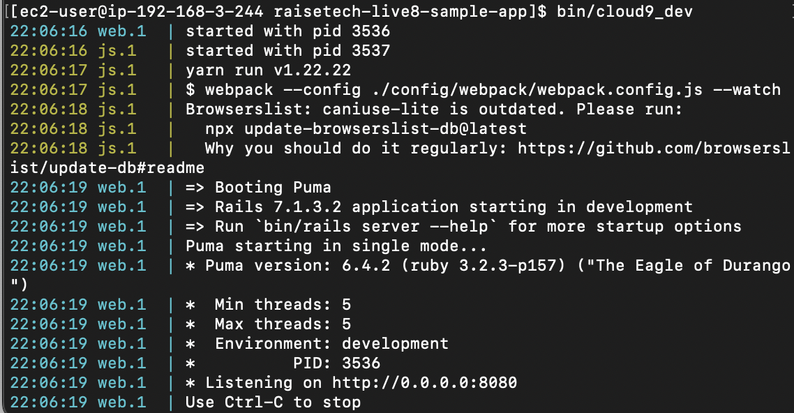

# 第三回課題
## 1.サンプルアプリケーションのデプロイ 
EC2とRDSを利用したデプロイ(clous9の代替で使用)  
ブラウザでのアクセス：bin/cloud9_dev  
  
## 2.APサーバー  
name:Puma version:6.4.2  
APサーバーの終了→アクセス不可  
  
## 3.DBサーバー  
name:MySQL version:8.0.39  
RDSの停止→アクセス不可  
> [!NOTE]  
> ローカルのMySQLを停止と開始、確認  
> ```sudo service mysqld stop```  
> ```sudo service mysqld start```  
> ```sudo service mysqld status```  

  
  
## 4.Rails構成管理ツール
**bundler**  
bundlerとはgemのバージョンやgemの依存関係を管理するツール。あるgemを使うために別のあるgemを使う必要があるといった関係を依存関係という。bundlerは依存関係が解決されたgemを一括でインストールしてくれ、複数人（台）のPCで作業する際も同じバージョンのgemを一括でインストールすることができる。