# 第４回課題  
## VPC  
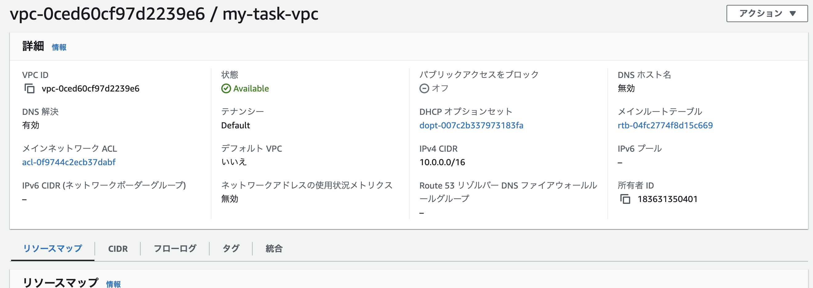  
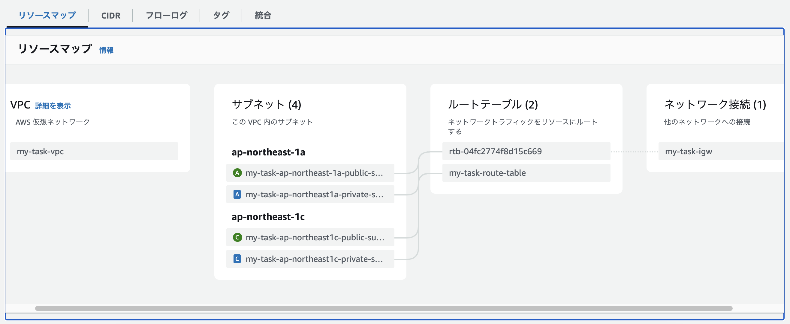   
  
## サブネット  
+ ap-northeast-1c パブリックサブネット  
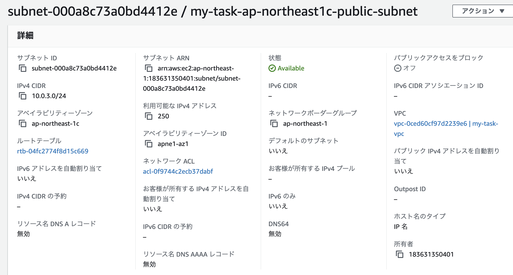  
+ ap-northeast-1c プライベートサブネット  
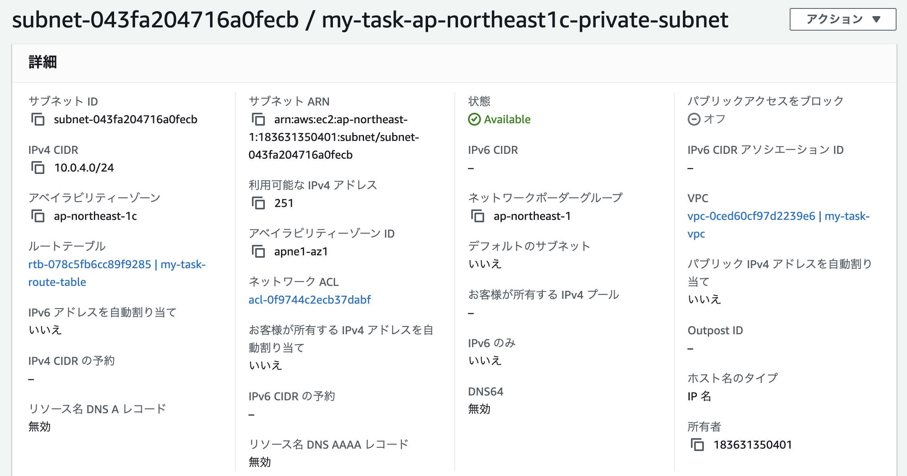  
+ ap-northeast-1a パブリックサブネット  
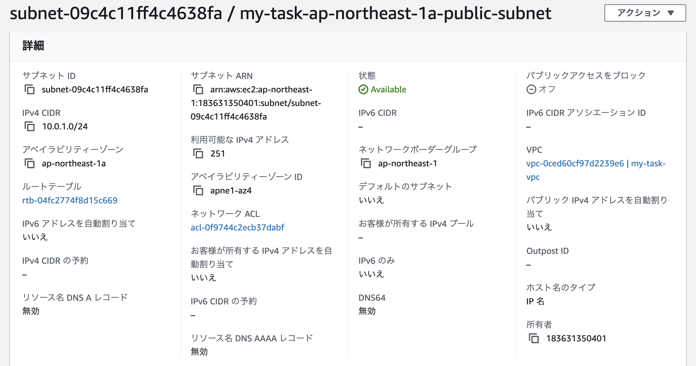  
+ ap-northeast-1a プライベートサブネット  
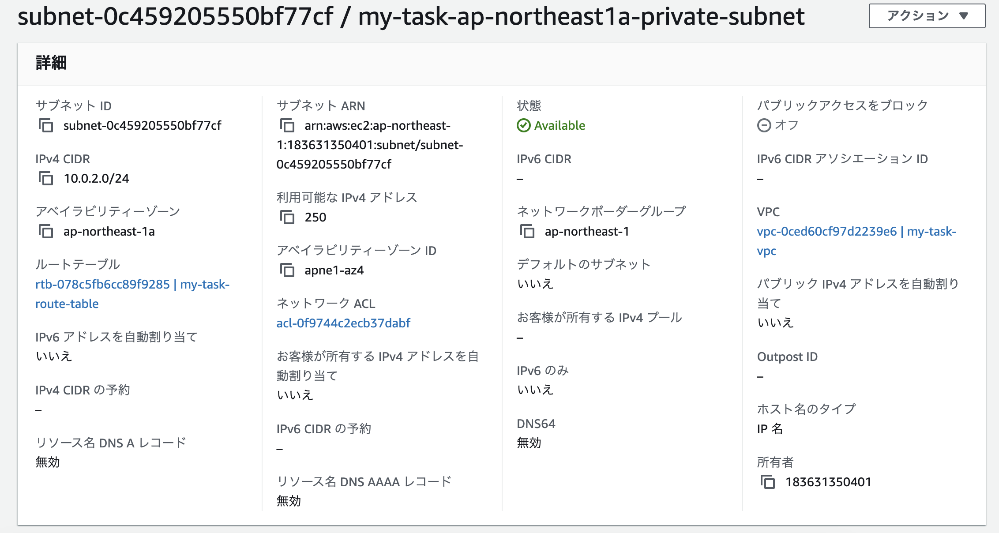  

## EC2  
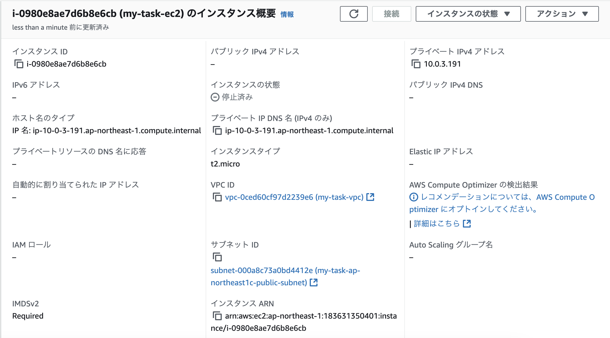  

## RDB  
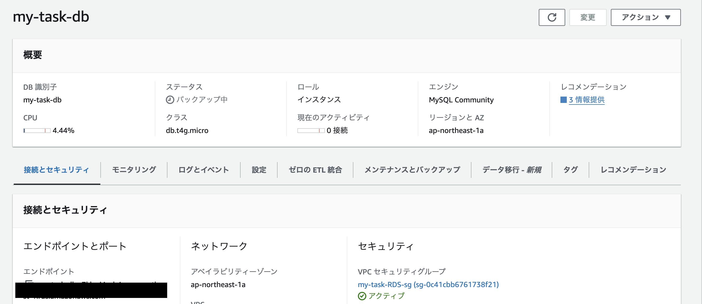  
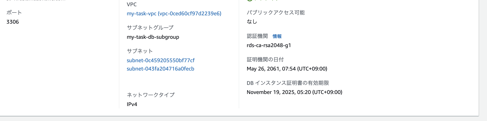  

## セキュリティグループ  
+ EC2インバウンド  
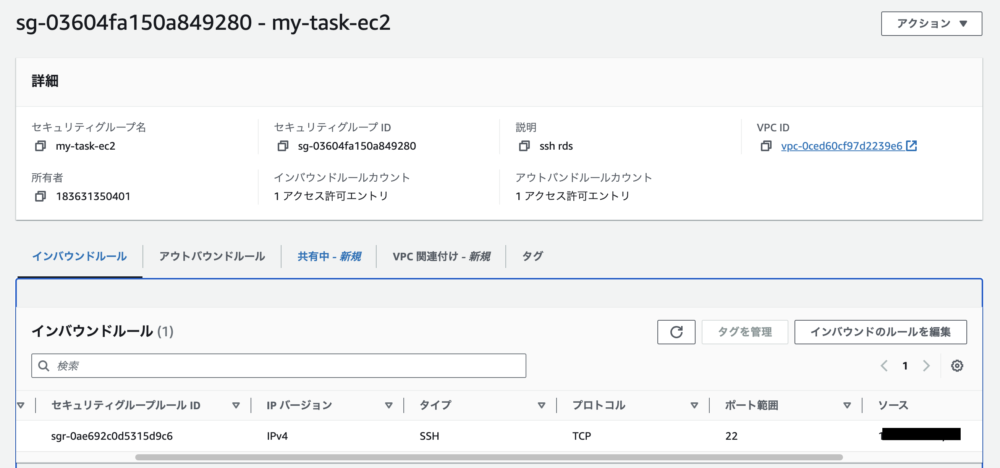  
+ EC2アウトバウンド  
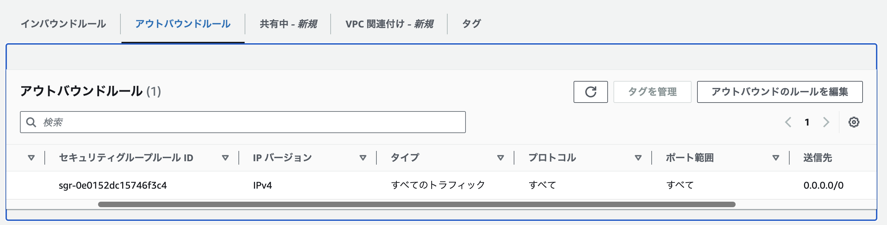  
+ RDSインバウンド  
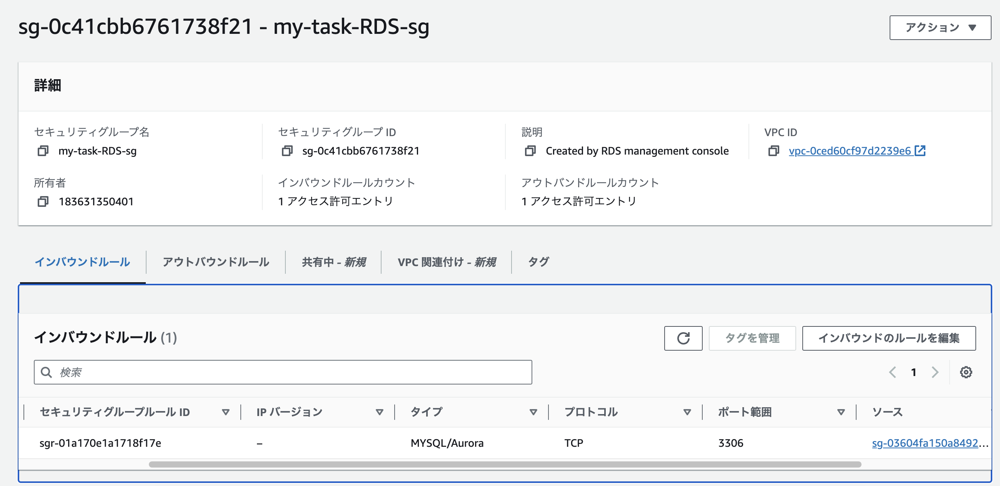  
+ RDSアウトバウンド  
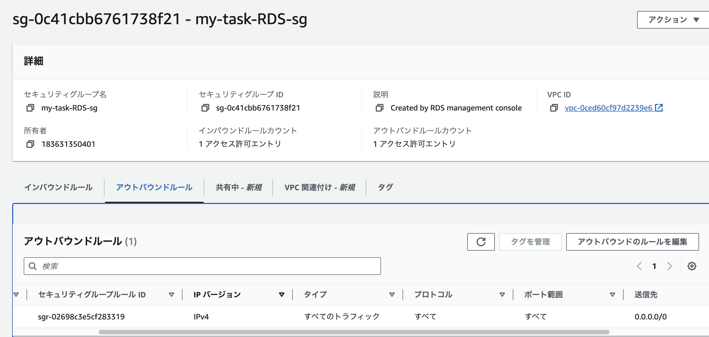  

## EC2にSSH接続  
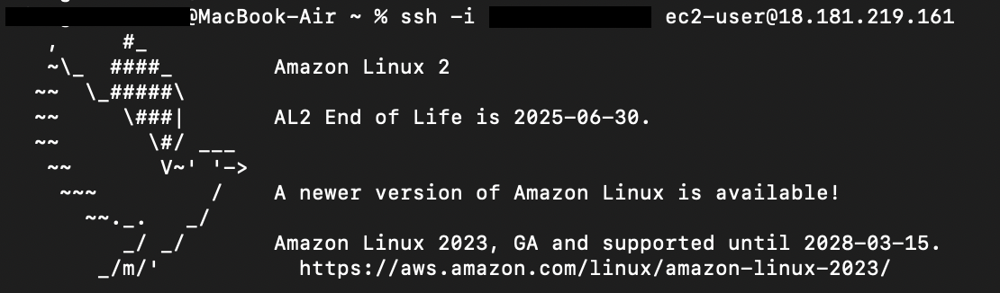  

## EC2とRDSの接続  
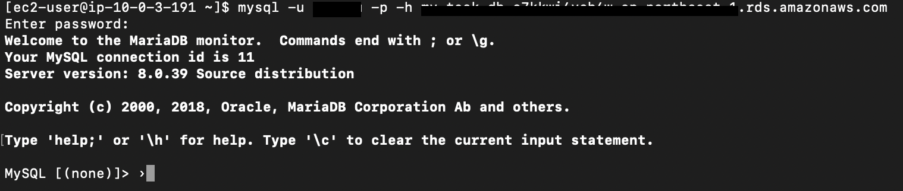  

## 所感  
初めてVPCとサブネットを作成した際は、IPv4 CIDRの設定値に関して、サブネットが作成不可というエラーが繰り返し起き大変であった。これはCIDRの意味とサブネットの意味を理解しきれていないことが原因であった。
しかし、今回は作成が複数回目ということもあり、以前よりCIDRの理解も進んでおり、難なくサブネットを作成することに成功し、微小であるが進歩を感じた。