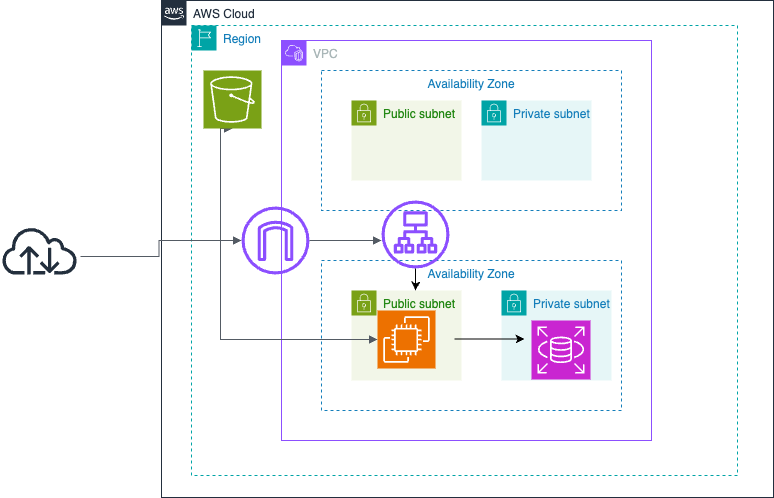

# 第５回課題講義  
## 組み込みサーバーでデプロイ
```
# パッケージのバージョンアップ
sudo yum update  

# railsのパッケージ  
sudo yum  -y install git make gcc-c++ patch libyaml-devel libffi-devel libicu-devel zlib-devel readline-devel libxml2-devel libxslt-devel ImageMagick ImageMagick-devel openssl-devel libcurl libcurl-devel curl  

# rbenvのインストール  
git clone https://github.com/sstephenson/rbenv.git ~/.rbenv  

# Ruby-buildのインストール  
git clone https://github.com/sstephenson/ruby-build.git ~/.rbenv/plugins/ruby-build  

# rbenvのコマンドハッシュ更新  
rbenv rehash  

# 指定したバージョンのRubyのインストール  
rbemv install -v 3.2.3  
rbenv global 3.2.3  
rbenv rehash  
ruby -v  

# nvm,Node.jsのインストール  
curl -o- https://raw.githubusercontent.com/nvm-sh/nvm/v0.38.0/install.sh | bash  
source ~/.bashrc  
nvm install v17.9.1  
node -v  

# yarnのインストール  
curl -sL https://dl.yarnpkg.com/rpm/yarn.repo | sudo tee /etc/yum.repos.d/yarn.repo  
source ~/.bashrc  
sudo yum -y install yarn  
yarn -v  

# アプリケーションのクローン  
git clone コード  

# bundlerのインストール  
gem install bundler -v2.3.14  

# gemのインストール  
bundle install  

# yarnのインストール  
yarn install  

# railsのインストール  
gem install rails -v7.1.3.2  

# database.ymlの編集  
cp config/database.yml.sample config/database.yml  
default: &default  
username: ユーザー名  
password: RDSのパスワード  
host: RDSのエンドポイント  
yml記述のため記法に注意  

# 環境構築  
bin/setup  

# RDSの接続  
mysql -u ユーザー名 -p -h エンドポイント  
show databases;で接続確認  

# デプロイ  
rails s -b 0.0.0.0  

# ブラウザでアクセス  
EC2のパブリックID：3000
```  
  

## Unix Socketを使った動作確認  
puma設定ファイル→config/puma.rb  
Unixソケットのバインドでソケットファイルを指定→pumaを実行するとpuma.sockが作成  
```  
curl --unix-socket /home/ec2-user/raisetech-live8-sample-app/tmp/sockets/puma.sock http://localhost/  
```  
  

## Nginxの動作確認  
```  
# インストール  
sudo amazon-linux-extras install nginx1  

# 起動  
sudo systemctl start nginx  

# 停止  
sudo systemctl stop nginx  

# 再起動  
sudo systemctl restart nginx  

# 状態確認  
sudo systemctl status nginx  

# エラーログ  
sudo vi /var/log/nginx/error.log  
sudo tail /var/log/nginx/error.log  
```
→nginxの起動を確認：welcome to nginx!  

  

## puma,Nginx,Unix Socketでデプロイ  
Nginxをリバースプロキシとしてpumaの前に設置して、Unixソケットを経由してNginxとpumaが通信を行えるようにする  
nginxの設定ファイルの変更→/etc/nginx/nginx.conf  
user nginx → user ec2-user   

/etc/nginx/conf.d/に設定ファイルを作成  
rails.confという設定ファイルを作成  

設定ファイルの設定に問題がないか確認  
`sudo nginx -t`  
successfullでOK  

Nginxとpumaを起動  

  

  

  

  

## ALBの追加  
1. ターゲットグループとセキュリティグループを作成  
1. ELB(ALB）を新規作成  
1. EC2のセキュリティグループにALBのセキュリティグループをポート80で開放 
1. config/environmets/development.rbに追加  
 `config.hosts << "ALBのDNS名"`   
5. Nginxとpumaを起動  
6. ALBのDNS名でブラウザを確認  
  
  
  

## S3の追加  
1. バケットを作成  
1. S3にアクセス可能なIAMポリシーを作成  
1. 作成したIAMポリシーをIAMロールにアタッチ  
1. EC2にIAMロールを付与    
1. アクセスキーとシークレットアクセスキーを作成  
1. config/environments/development.rbの編集  
config.active_storage.service = :local→config.active_storage.service = amazon  
1. config/storage.ymlの編集  
service: S3  
region: ap-northeast-1  
buclet: バケット名  
access_key_id: <%=EMV['AWS_ACCESS_KEY_ID'] %>  
secret_access_key: <%=EMV['AWS_SECRET_ACCESS_KEY'] %>  
>[!note warn]  
>アクセスキーとシークレットアクセスキーはセキュリティ上、環境変数を設定すること  
>export AWS_ACCESS_KEY_ID="作成したアクセスキー"  
>export AWS_SECRET_ACCESS_KEY="作成したシークレットアクセスキー"  
>source ~/.bashrc  

IAMポリシー  
  
 
  

## 構成図  
  
