# 課題６  
## CloudTrailの使用  
イベント：EC2インスタンスの起動  
イメント名→StartInstances  
誰が操作したか→UserName  
何が変更されたか→AWS::EC2::Instance  
どう変更されたか→pending(起動準備中)  
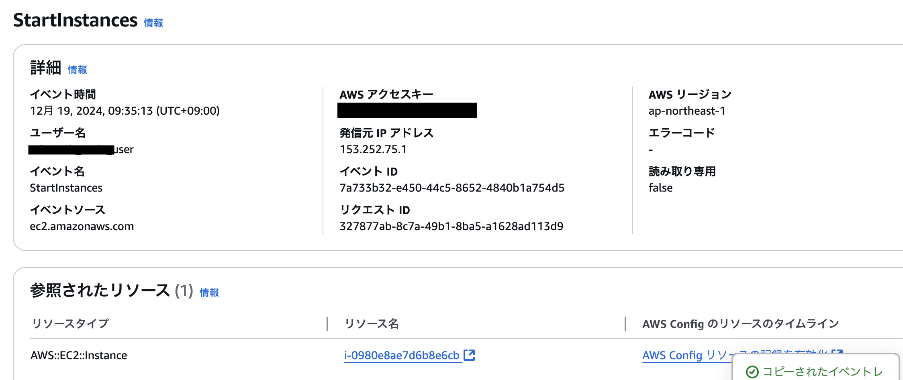  

## CloudWatch  
### パターン1:ALBのUnHealthyHostCountを対象  
#### 設定  
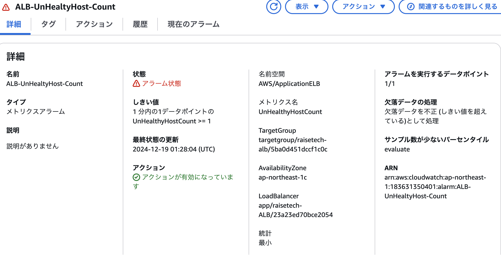  
* ステータスUnHealthy状態のターゲットグループの数を対象  
* 期間１分間で生成されるデータポイントが１回でしきい値(個数１以上)を超えるとアラーム通知
→UnHealty状態が１つでもあればアラーム  
* 欠落データポイントは「不良」とされ、しきい値超過として扱う  

#### UnHealthy→Healthy  
* pumaとNginxを起動しアプリが正常稼働  
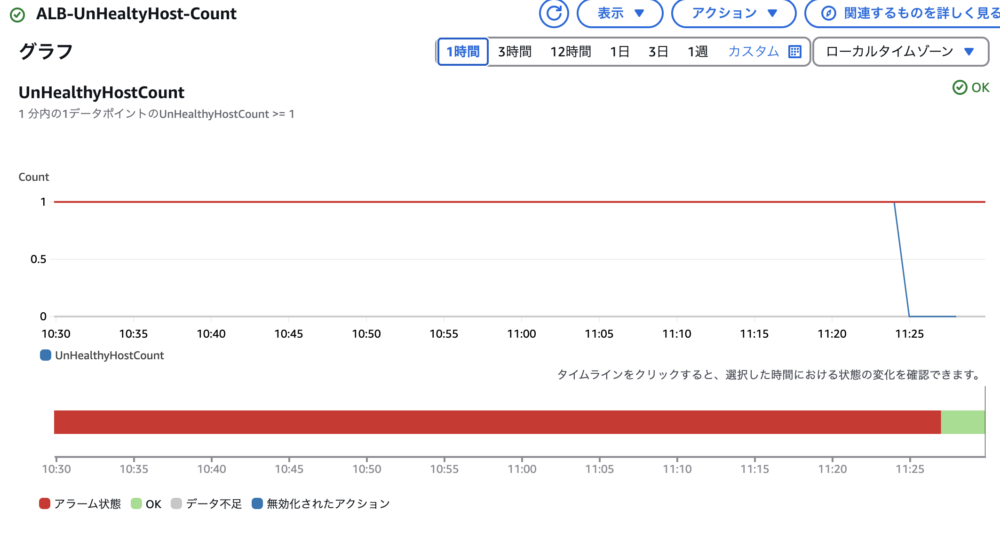

#### Healthy→UnHealthy→Unused  
* pumaとNginxを停止しアプリが異常稼働→EC2を停止（Unused）
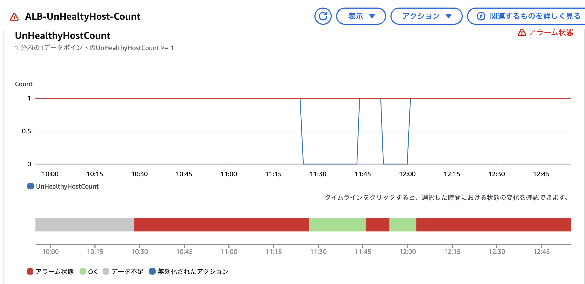  
ヘルスステータスがUnusedになる＝欠落データポイントが発生  
欠落データポイントを不正で設定＝しきい値超過で扱いUnHealthyと同様  

* しきい値超過によるアラーム  
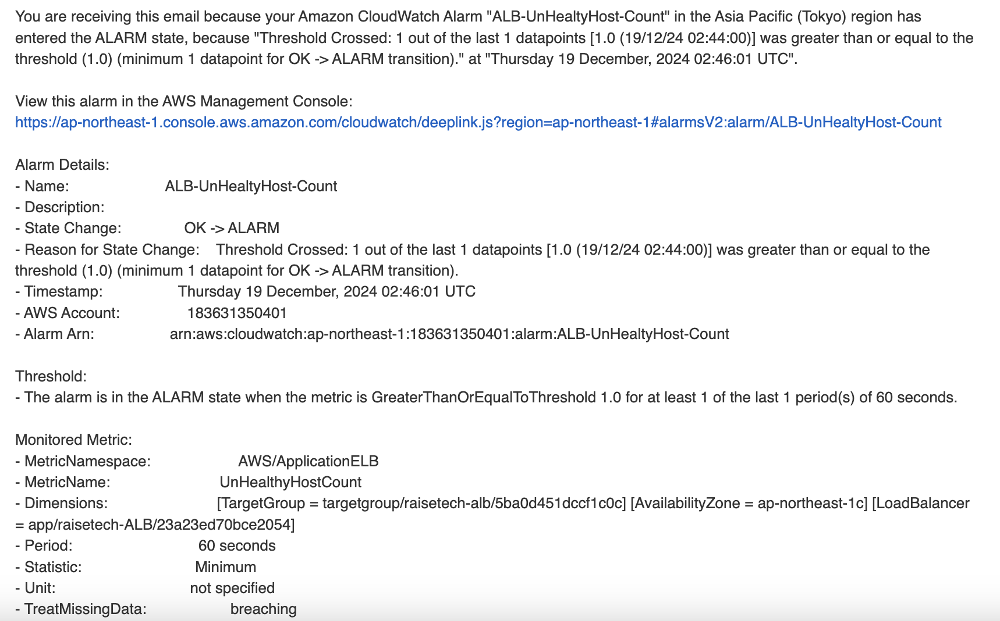  

### パターン２:ALBのHealthyHostCountを対象  
#### 設定  
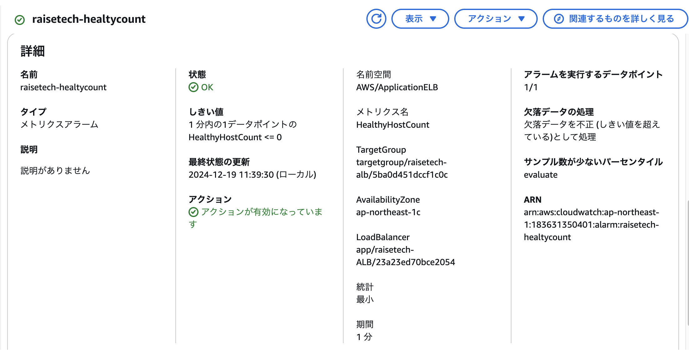  
* ステータスHealthy状態のターゲットグループの数を対象 
* 期間１分間で生成されるデータポイントが1回でしきい値（個数0以下）を超えるとアラーム通知  
* 欠落データポイントは「不良」とされ、しきい値超過として扱う  

#### UnHealthy→Healthy  
* pumaとNginxを起動しアプリを正常稼働  
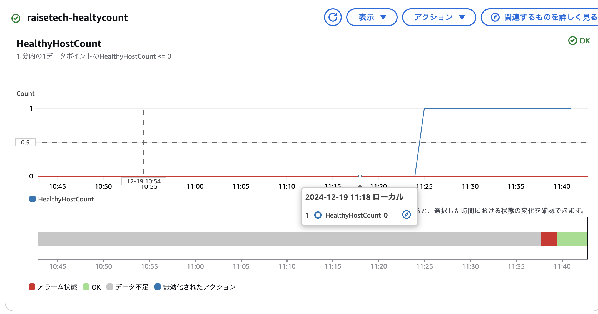  

##### Healthy→UnHealthy→Unused  
* pumaとNginxを停止しアプリが異常稼働→EC2を停止（Unused)  
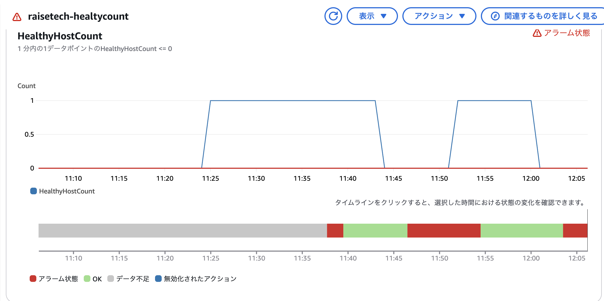  
ヘルスステータスがUnusedになる＝欠落データポイントが発生  
欠落データポイントを不正で設定＝しきい値超過で扱いUnHealthyと同様  

* しきい値超過によるアラーム  
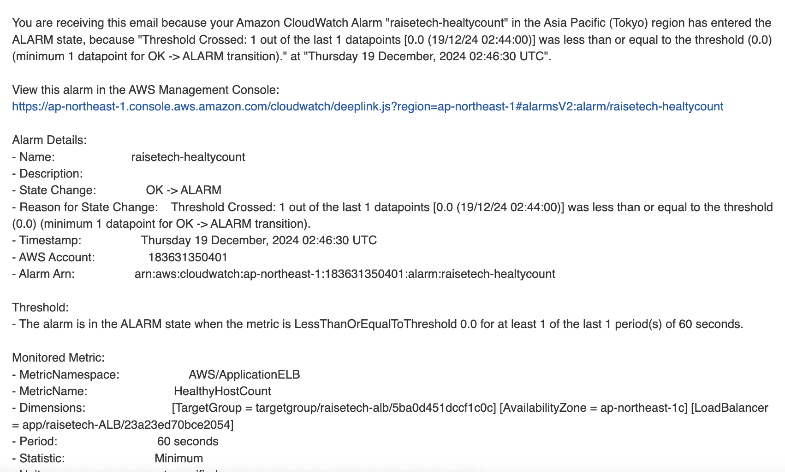  

## AWS利用料の見積り  
[AWS利用見積](https://calculator.aws/#/estimate?id=daa5a7e1e005cbb48b765c06c28c058582a84fc1)  

## 現在の利用料  
* 11月の利用料  
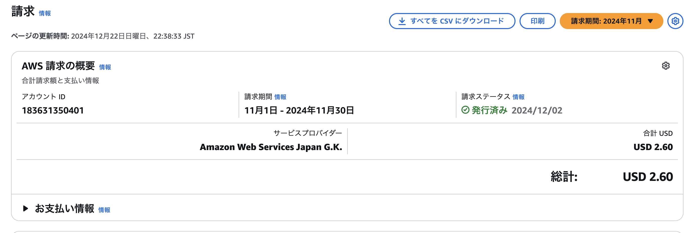  
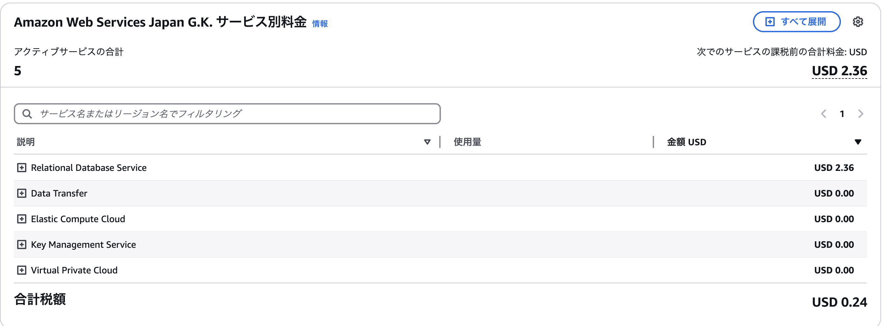  
* 考察  
11月の利用料の内訳によると、RDSに料金が発生している。そこで、Cost Explorerを確認すると11月７日から料金が発生してることを把握した。月初に料金が発生しているため、無料利用枠の時間超過ではないため、そもそものRDSの設定が無料利用枠外の可能性と考えられた。作成したRDSの中身を調べた結果、クラスが「db.t4g.micro」になっており、RDSの無料利用枠の対象外のクラス（対象：db.t2.micro）であることを把握した。

