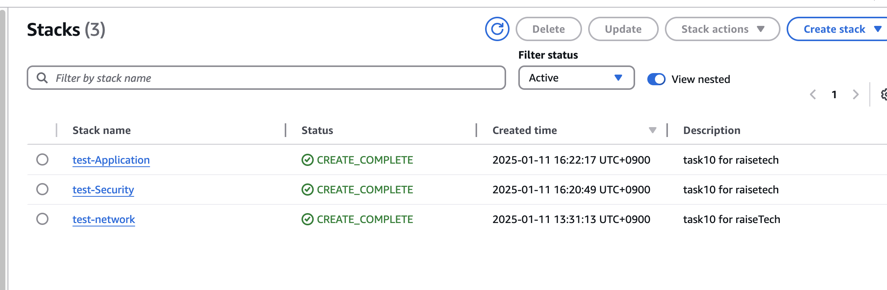
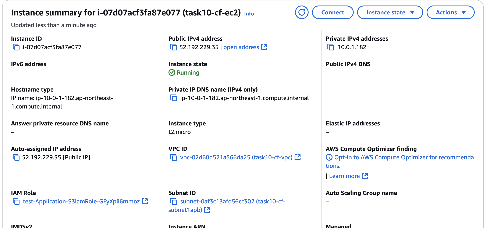
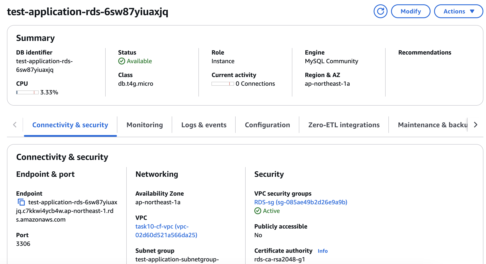
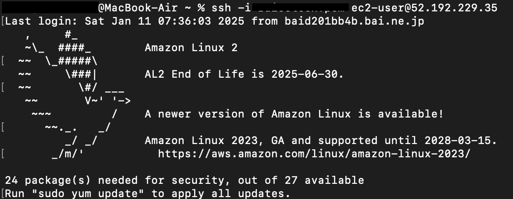
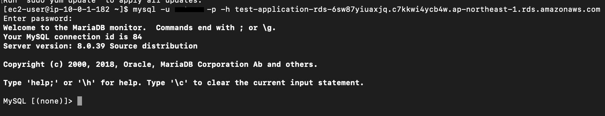

# 課題１０  

## 課題内容  
これまで作成したAWS環境をCloudFormationで構築  

## 構造  
NetWork:VPC/サブネット/インターネット接続  
Security:セキュリティグループ  
Application:EC2/RDS/ALB/S3  

## テンプレート  
[Network](cloudformation/Network.yml)  
[Security](cloudformation/Security.yml)  
[Application](cloudformation/Application.yml)  

##  Stack  
  

## 接続確認  
EC2  
  
RDS  
  
EC2接続  
  
RDS接続  
  

##  所感  
それぞれのリソースの設定項目と設定値を把握する必要があり、調べながらの作成は時間がかかった。
また、Palametersや関数をもっと活用したり、AWS CLIでスタックを作成するなど、更に身につけるべき技術は多く、課題が残るため引き続き学んでいきたい。