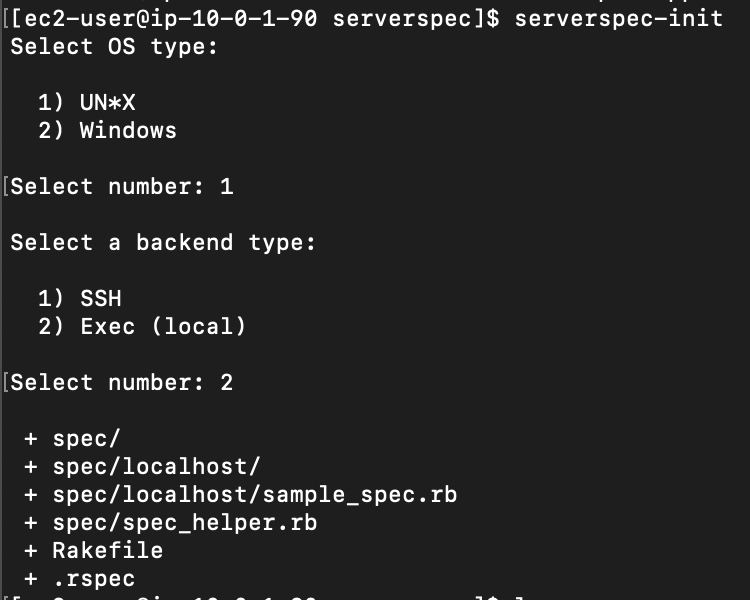
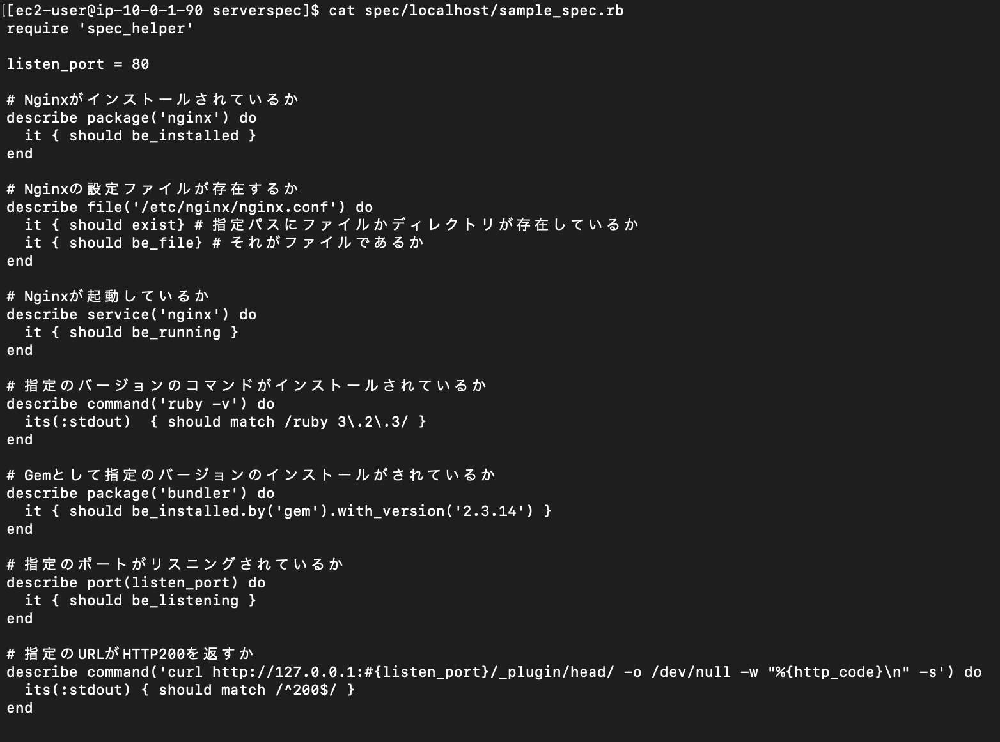
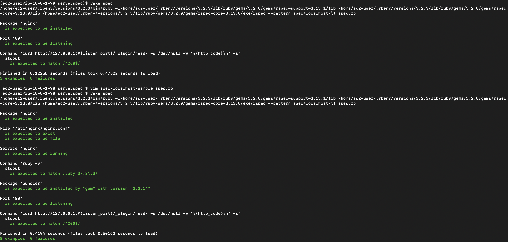

# 課題11  

## 内容  
課題10で作成したCloudFormationを使用してServerspecで自動テストを行う。  

## Serverspec  
Rspecでサーバーの構成に問題がないかを自動でテストするフレームワーク  

## 手順  
### インストール  
```
gem install rake  
gem install serverspec
```  
### 作業用ディレクトリの作成  
* serverspecディレクトリを作成  
* 作業用ディレクトに移動  
### テスト実行用のファイルを作成  
```serverspec-init```  
serverspec/spec/localhost/sample_spec.rbが作成される  
  

### テスト内容を記載  
sample_spec.rbにテスト内容を記載する  
  

### テストを実行  
`rake spec`  
  
