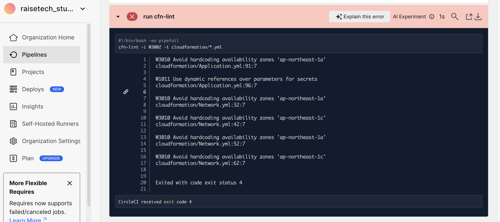
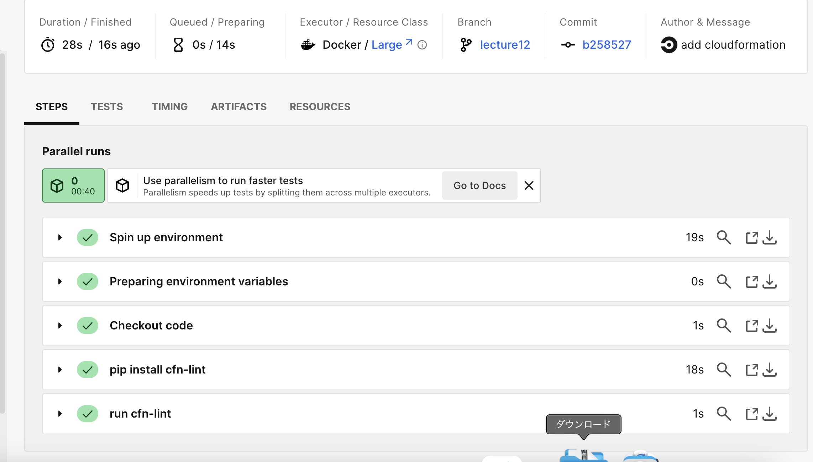

# 課題１２  
## 内容  
circleciの[サンプル](sample-config.yml)を使用して、正しく動作するようリポジトリに組み込む。  
>[!NOTE]  
>cloudformation/*.ymlを自分のファイル名に変更する  
>今回はcloudformationファイルを使用しているためそのまま使用  

## 処理結果  
### WARNINGの発生  
* ハードコーディング
* RDSのパスワードを動的参照にすること
  
  
### WARNINGの解消  
* Parametersを使用してハードコーディングを解消  
* Secrets Managerを使用して動的参照に変更  
  
  
##  所感  
最初はサンプルコンフィグの使用方法がわからなかった。そのため、GitHubでテスト用リポジトリを作成し、サンプルコンフィグをプッシュして試しにcircleciを起動してテストを実行→訂正を繰り返し検証を行った。その結果、今回の課題における使用方法は無事に解消し、その利便性も感じることができ、今後の自主学習でも積極的に使用していきたい。
