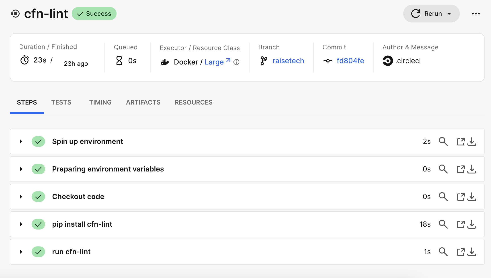
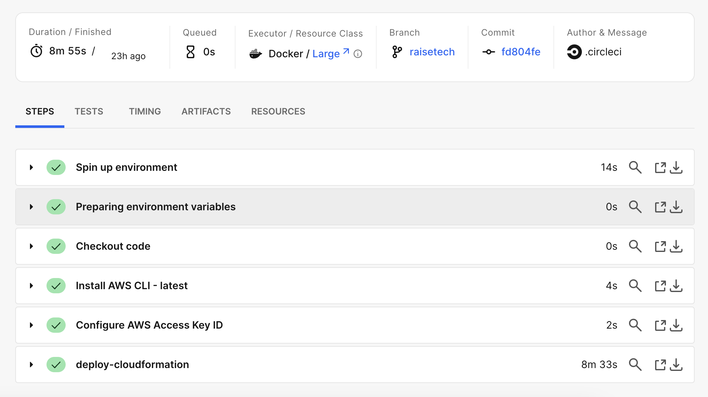
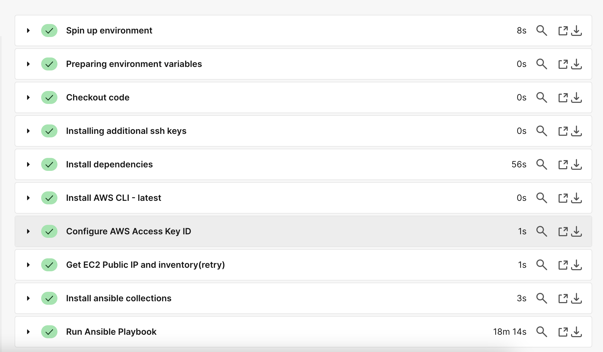
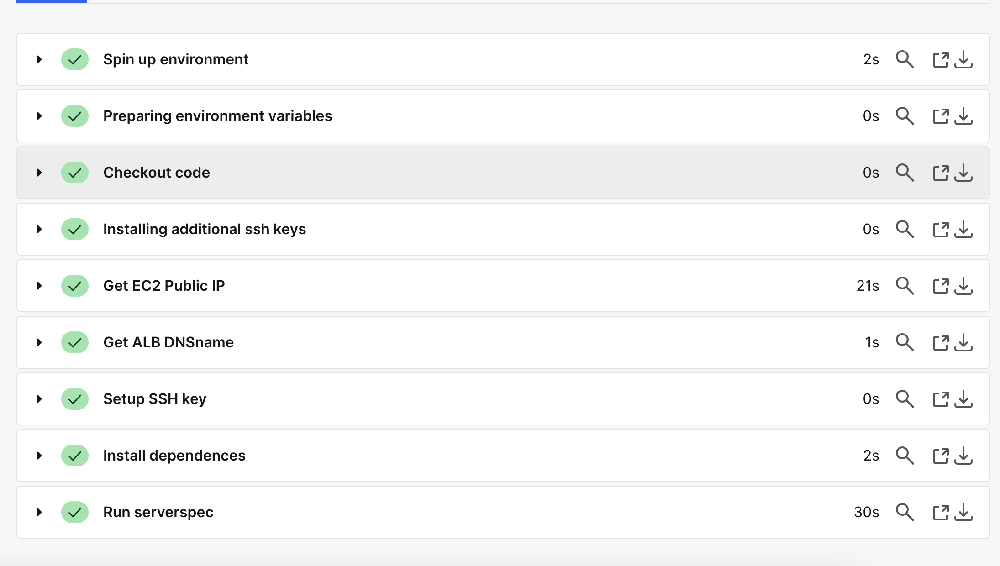
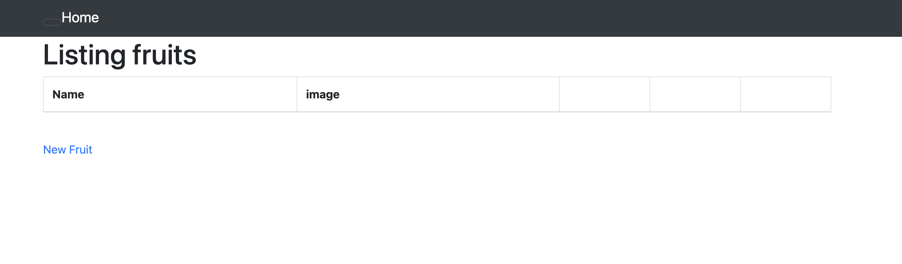

# 課題１３  
## 目的  
circleciによる自動化  
[実行用リポジトリ](https://github.com/satoru-AWS/RaiseTech13)  
  
## 手順  
1. cfn-lintでcloudformationの構文チェック  
2. execute-cloudformationでAWS環境を構築  
3. execute-ansibleでrailsアプリ環境を構築  
4. execute-serverspecで自動テスト  
  
## 結果  
1. cfn-lintでcloudformationの構文チェック  
  
2. execute-cloudformationでAWS環境を構築  
  
3. execute-ansibleでrailsアプリ環境を構築  
  
4. execute-serverspecで自動テスト  
  
5. ALBのDNS名でアクセス  
  
  
## 所感  
自分にとって今回の課題は非常に困難な道程であった。特にansibleの部分は一つ記述するとエラーになるため、その原因を突き止め、改善するということを何回も繰り返し、多大な時間がかかった。その分理解したことも多く、また、自動化を構築したことで、インフラエンジニアに必要な力が何かというのを感じ取れた気がする。
