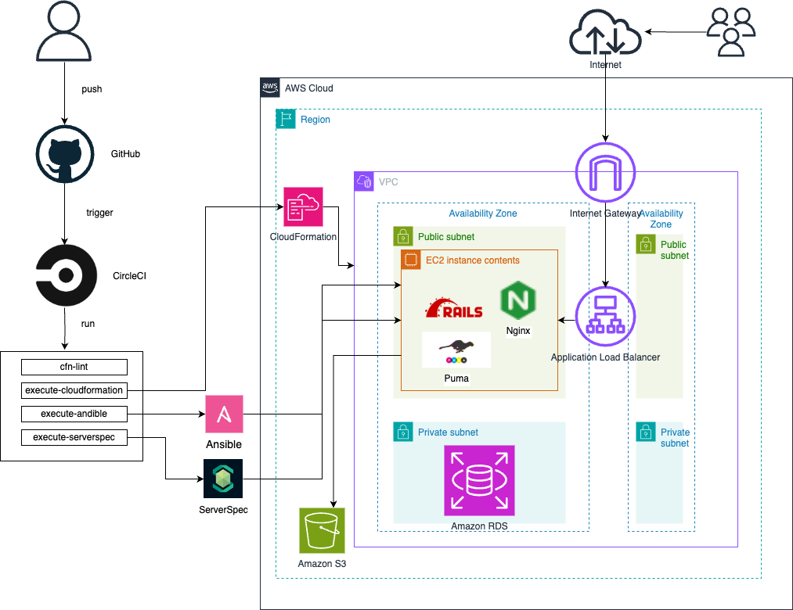

# 課題１４  
## 内容  
これまでのAWS構成図、リポジトリのREADMEを作成  

### 構成図  
  
  
  
### リポジトリのREADME  
  
リポジトリのREADMEは[こちら](READEME.md)  
  
## 所感  
AWS構成図を作成することで、自らが作成した自動化処理が明確になり非常に分かりやすくなったと感じた。  
今後も積極的にAWS構成図を作成し、自分だけでなく、第三者にも理解を得られるような構成図の技術を向上していきたい。  
